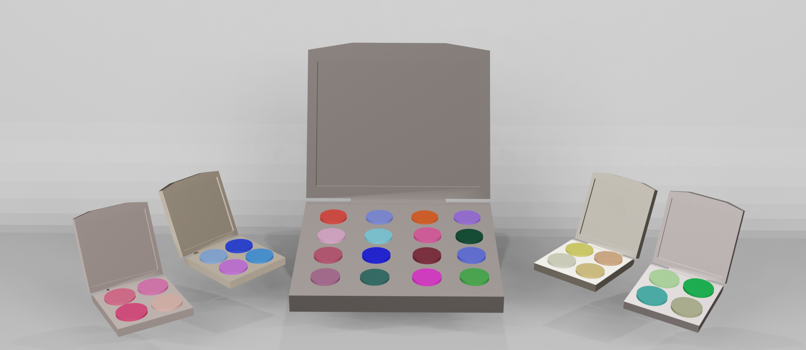

 <section class="post container">

              <!--------------------Post Box 1------------------->
              <a href="aifashion.html" class="post-box-link">
                

                    
                    <h2 class="category">Artificial Intelligence / Year Three</h2>
                    
AI Fashion Magazine / Trend Analysis

                    
High fashion / editorial AI generated photos created by a trained machine learning model from RunwayML.

                    Feb •  2 0 2 4
                

        
                
                <!----------Profile-------->
                <!-- 

                    
                    17/11
                
 -->
            </a>

                <!--------------------Post Box 2------------------->
                <a href="ethics.html" class="post-box-link">
                    

                        
                        <h2 class="category">Artificial Intelligence / Year Three</h2>
                        
Ethics of AI in Healthcare

                        
An essay discussing the advancements and problems of AI integrated in healthcare.

                        Jan •  2 0 2 4
                    

               
                    <!----------Profile-------->
                    <!-- 

                        
                        17/11
                    
 -->
                </a>
        
        <!--------------------Post Box 3------------------->
        <a href="ai_blog.html" class="post-box-link">
            

                
                <h2 class="category">Artificial Intelligence / Websites / Year Three</h2>
                
DIGITAL DIALOGUE: The Danger of AI Chatbots

                
A blog website featuring several articles surrounding the benefits and drawbacks of AI chatbots.

                Jan •  2 0 2 4
            

        </a>
        

  

        <!--------------------Post Box 4------------------->
        <a href="aarhus.html" class="post-box-link">
            

                
                <h2 class="category">Coding / Websites</h2>
                
Aarhus University: C++

                
A website depicting my experience taking a C++ course at Aarhus University.

                Aug •  2 0 2 3
            

      
        
            <!----------Profile-------->
            <!-- 

                
                17/11
            
 -->
        </a>

        <!--------------------Post Box 5------------------->
        <a href="bigdata.html" class="post-box-link">
            

                
                <h2 class="category">Coding / Year Two</h2>
                
Big Data: Cruelty Free Makeup Palette

                
Cosmetic websites and datasets scraped to find cruelty-free products - data presented in a makeup palette.

                Jun •  2 0 2 3
            

       
            
            <!----------Profile-------->
            <!-- 

                
                Last updated: 27/12
            
 -->
        </a>
        
        <!--------------------Post Box 6------------------->
        <a href="datavis.html" class="post-box-link">
            

                
                <h2 class="category">Websites / Coding / Year Two</h2>
                
Data Visualisation: Song Popularity

                
A website depicting the correlation between popular songs and audio features scraped from Spotify API.

                Jun •  2 0 2 3
            

       
        <!----------Profile-------->
        <!-- 

            
            17/11
        
 -->
    </a>
            <!--------------------Post Box 7------------------->
            <a href="appdev.html" class="post-box-link">
                

                    
                    <h2 class="category">Coding / Year Two</h2>
                    
App Development / Swift

                    
First iOS app created using SwiftUI - SongSearch aims to help users find new music and live events.

                    Jun •  2 0 2 3
                

            
                <!----------Profile-------->
                <!-- 

                    
                    17/11
                
 -->
            </a>
    

        <!--------------------Post Box 8------------------->
        <a href="hci.html" class="post-box-link">
            

                
                <h2 class="category">Blender / Year Two</h2>
                
Virtual Reality Art Therapy Controller

                
A virtual reality controller and headset prototype designed for art therapy sessions, created in blender.

                Jan •  2 0 2 3
            

     
            
            <!----------Profile-------->
            <!-- 

                
                17/11
            
 -->
        </a>
        

            <!--------------------Post Box 9------------------->
            <a href="webdev.html" class="post-box-link">
                

                    
                    <h2 class="category">Coding / Year Two</h2>
                    
Web Development

                    
Experimental website - first introduction into HTML/CSS - a list of different techniques used.

                    Jan •  2 0 2 3
                

           
                <!----------Profile-------->
                <!-- 

                    
                    17/11
                
 -->
            </a>
            
            <!--------------------Post Box 10------------------->
            <a href="processing.html" class="post-box-link">
                

                    
                    <h2 class="category">Coding / Year One</h2>
                    
Processing

                    
Looking to the future, it is important to predict and envision how the use of AI chatbots may look, whether that be negative or potentially positive. Apart from romantic relationships, companions or even mental health therapists, AI chatbots have the potential to be used in many different fields. In mental health care, AI chatbots are projected to remotely diagnose patients, potentially yielding results comparable to face-to-face therapy. For online shopping, AI chatbots are expected to remember user preferences, autonomously recommend products, and provide real-time analytics. In online banking, they could offer personalised services like money transfers and financial advice.

                    Jun •  2 0 2 2
                

         
            
                <!----------Profile-------->
                <!-- 

                    
                    17/11
                
 -->
            </a>

                <!--------------------Post Box 11------------------->
                <a href="arduino.html" class="post-box-link">
                    

                        
                        <h2 class="category">Coding / Year One</h2>
                        
Arduino: Art Installation

                        
Interactive art piece using conductive paint - reacts to touch outputting different sounds and lights.

                        Jun •  2 0 2 2
                    

             
        <!----------Profile-------->
        <!-- 

            
            17/11
        
 -->
    </a>
        

        <!--------------------Post Box 12------------------->
        <a href="p5.js.html" class="post-box-link">
            

                
                <h2 class="category">Coding / Year One</h2>
                
p5.js

                
A collection of games, animation, and drawings I have designed and developed.

                Jan •  2 0 2 2
            

      
        
            <!----------Profile-------->
            <!-- 

                
                17/11
            
 -->
        </a>

        <!--------------------Post Box 13------------------->
        <a href="python.html" class="post-box-link">
            

                
                <h2 class="category">Coding / Year One</h2>
                
Python: Maze Game

                
First two-player maze game created using Python, includes a timer and music.

                Jan •  2 0 2 2
            

      
            <!----------Profile-------->
            <!-- 

                
                17/11
            
 -->
        </a>

        

    
    

 
</section>